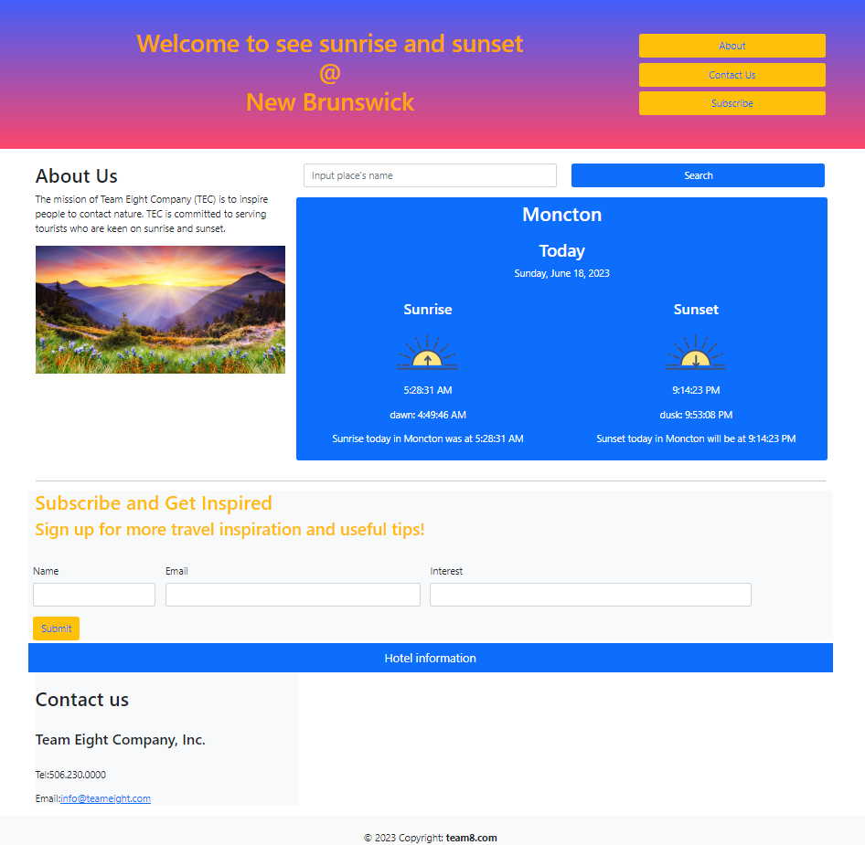

# Sunset and sunrise

## User Story
AS A traveler
I WANT to see the sunset and sunrise outlook for multiple cities
SO THAT I can plan a trip accordingly

## Description
 Sunset and sunrise starts with search for a city. User can see current sunset and sunrise for that city.
 It presents with the city name, the date, time sunrice and time sunset. Subscribe and Get Inspired and related data save in local storage. User can change city and save it in local storage. When user refresh the page сity steal populated in the page. 

## Gitpage reference
https://zoeyyanling.github.io/sunrise-and-sunset/

## Screen shots

The following scrshots shows the web application's:

## Acceptance Criteria
GIVEN a Sunset and sunrise with form input
WHEN I search for a city
THEN I am presented with current conditions for that city
WHEN I view current sunset and sunrise for that city
THEN I am presented with the city name, the date, time sunrice and time sunset
WHEN I refresh the page сity steal populated in the page

